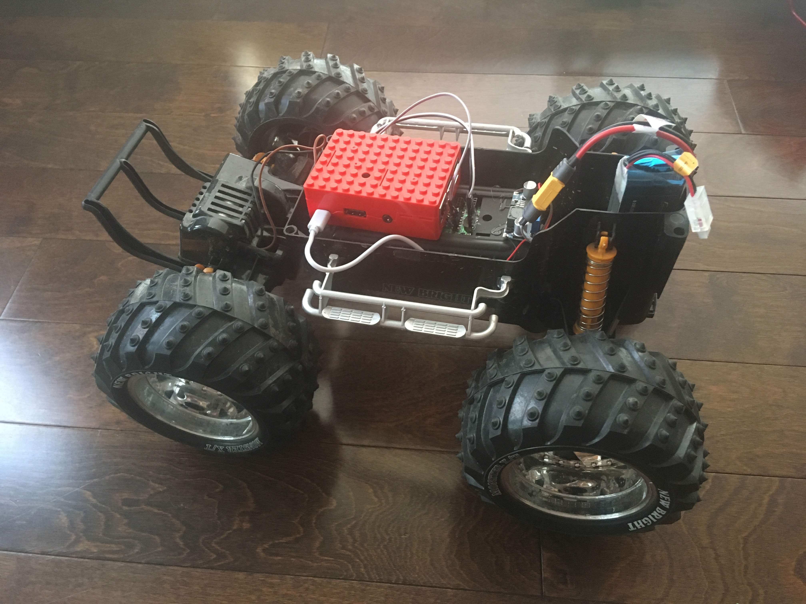
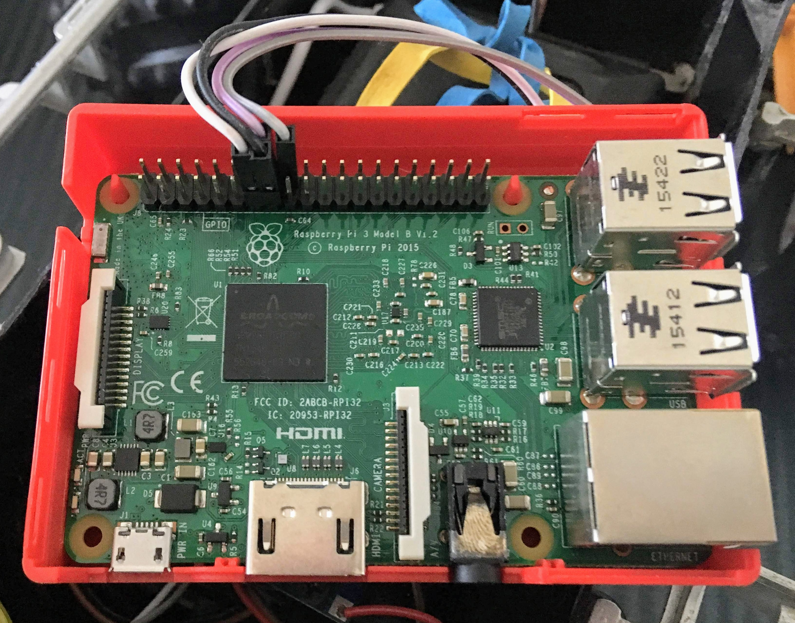
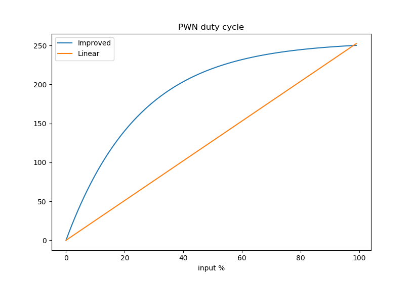

# RCHummer
Raspberry Pi controlling a Newbright RC Hummer toy.

New opening on the hood for battery swapping (later I will need to 3D print something to cover it...):  

Video of my first real test:  

1. Enable Linux (or anything else) to share internet through ethernet.
  - https://askubuntu.com/questions/169473/sharing-connection-to-other-pcs-via-wired-ethernet
  - https://rhnvrm.github.io/2016-08-07-share-wifi-via-ethernet-gnome-3-20/
2. Test it with: $ ping raspberrypi.local
  - However, ssh will not work by default:
  - $ ssh pi@raspberrypi.local
  - ssh: connect to host raspberrypi.local port 22: Connection refused
3. Easiest solution, add a file to the DOS partition called ssh:
  - https://www.raspberrypi.org/documentation/remote-access/ssh/
  - But the file is automatically deleted after the boot! Therefore, it's necessary to enable it using 
  - $ sudo raspi-config  
Or
  - $ sudo systemctl enable ssh
  - $ sudo systemctl start ssh
4. Transforming a raspberry pi into an access point:
  - https://www.raspberrypi.org/documentation/configuration/wireless/access-point.md
5. Installing the pigpio:
  - $ sudo apt-get update
  - $ sudo apt-get install pigpio python-pigpio python3-pigpio
  - However, pigpiod will not be running by default. So: https://raspberrypi.stackexchange.com/questions/70568/how-to-run-pigpiod-on-boot
6. Installing python tornado
  - $ sudo pip install tornado 

Example of asymptotic curve used to reach higher speeds faster (remember, the motor response is not linear):  

